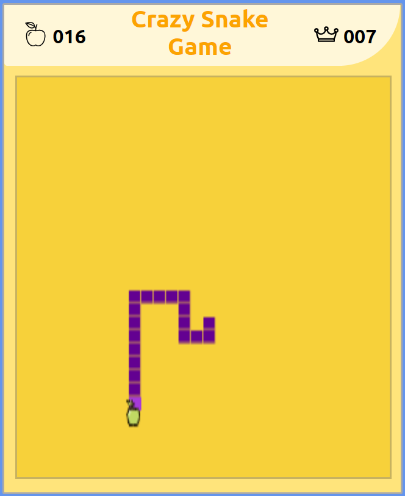

# snake

Old school JS snake game! Don't eat your tail!!!

view <a href="https://duanemcd.github.io/snake/"> crazy snake game!</a>!

## Summary

A "snake" game. Grow you score and your tail by eating apples.
Rules:

<ul>
  <li>You die if you hit a wall or yourself!
  <li>Arrow keys to control head direction
  <li>Space to pause the game
  <li>
</ul>

## Features

<ul>
  <li> beautiful classic design
  <li> highscore tracking (localStorage)
  <li> endless fun!
</ul>

## Technologies

<ul>
  <li> HTML5, CSS, JavaScript
  <li> HTML Canvas
  <li> LocalStorage
</ul>

### Author

Duane McDonald | Software Developer  
<a href="https://www.linkedin.com/in/duane-mcdonald-48a90136">linkedIn</a>  
<a href="https://www.DuaneMcDonald.com">Personal Website</a>  
